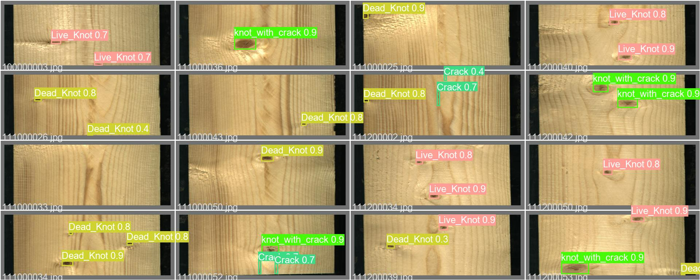
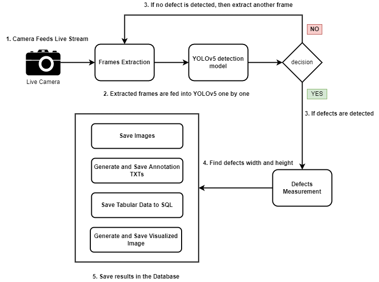
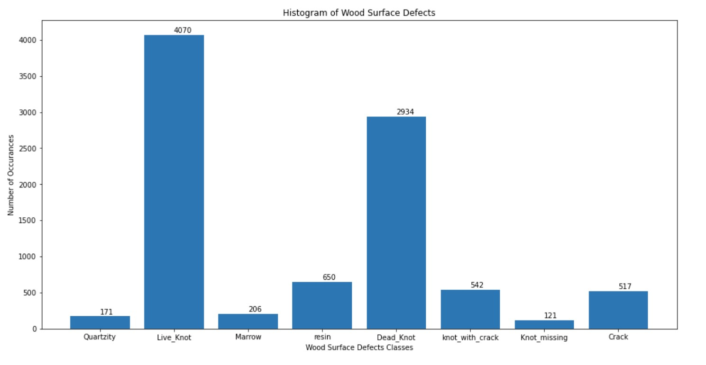
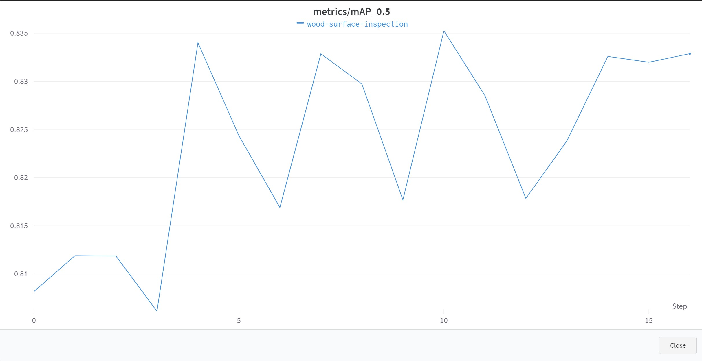
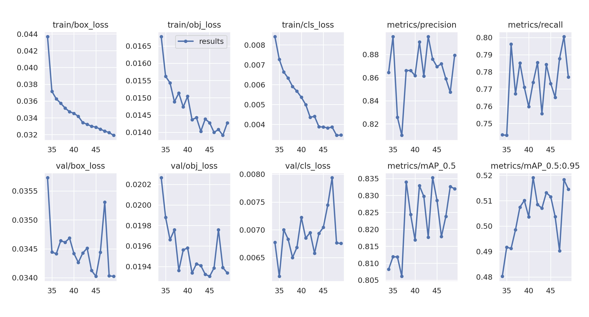
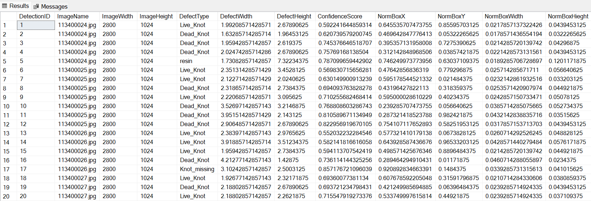

<div>
<h1>AI based Wood Surface Inspection </h1>

<div align="center">
  </a>
</div>

<p>
This project focuses on an automated system for wood surface inspection while identifying difference types of defects. The major part of the project is based on Deep Learning and Computer Vision techniques in addition with database. In particular, it utilizes python frameworks including OpenCV and Tensorflow for image processing and defects identification respectively.
</p>

<p>
The use of wood has been a widely used in today’s industry especially in construction and furniture making and can be very crucial in terms of its quality. As the manual visual inspection of wood needs human factor, therefore lack of attention and fatigue can lead to the false classification of wood, thus leading to major loss in earning.
The inspection process can be made automated using Computer Vision and Deep Learning techniques, hence bringing a significant increase in the productivity and reduction in labor cost. This work focuses on the segmentation and measurement of different types of defects in wood surfaces and saving the results in database.
</p>

<div align="center">
  </a>
  <br>
  System Design
</div>

## <div>About Dataset</div>
Adequate dataset is a mandatory element for any type of research work. Our first step is to train YOLOv5 on an adequate dataset with all type of possible wood surface defects labeled. Therefore, we explored different sources, open-sourced relevant datasets to prepare a dataset that can meet our requirements.

We came up with an open-sourced dataset names <b>“A large-scale image dataset of wood surface defects for automated vision-based quality control processes”</b>, which has fulfilled our need regarding the number of images, labeled classes and the environment the dataset has been prepared in. According to the article, the hardware setup used for collecting the data had the acquisition rate of 66 KHz of high-resolution images with dimensions 1024x4096. Total number of images that we collected during the time period were 20,276 out of which 1,992 images didn’t have any defects while 18,284 images had defects in them. The dataset itself covers 10 different types of defects.

<br>
<div align="center">
  </a>
  <br>
  Wood Surface Defects types.
</div>

## <div>Training Results</div>
With the dataset of 4,000 images split into 85:10 ratio for training/testing images respectively, we got an accuracy of around 83% on the testing set. The training results have been shown in the figures below.


<br>
<div align="center">
  </a>
  <br>
  Plot showing mAP (mean average precision) for training
</div>

<br>

<div align="center">
  </a>
  <br>
  Figure showing training results.
</div>

<br>

</div>


## <div>General Capabilities</div>

* Wood surface defects detections for 9 different classes.
* Runs on images, live webcam and video files.
* Images/Videos can be visualized during the inference for better monitoring.
* Results are saved in the form of raw images, visualized images, annotations in YOLO format and SQL database.

<br>

## <div>Quick Start Examples</div>

<details open>
<summary><h3><b>Install</b></h3></summary>

[**Python 3.7.0**](https://www.python.org/) or greater and other libraries are required listed in the requirements.txt. You must install Python before you proceed further.

```bash
# clone the repository 
$ git clone https://github.com/NaumanHSA/AI-based-Wood-Surface-Inspection

$ cd AI-based-Wood-Surface-Inspection
$ pip install -r requirements.txt
```

</details>

<details open>
<summary><h3><b>Inference</b></h3></summary>

Inference can be performed directly by running the inference.py script. But before we have to make sure the configurations are set in the CONFIG.py file, e.g. SOURCE is the path to any video or set it to 0 for webcam inference.

```bash
    python inference.py
```

Make sure to set the SQL Database credentials in the CONFIG.py file. The inference results are saved in the database as shown in the figure below.

<div align="center">
  </a>
  <br>
  Records saved in SQL database.
</div>

</details>

## <div>Author</div>

Muhammad Nouman Ahsan

## <div>References</div>

* A large-scale image dataset of wood surface defects for automated vision-based quality control processes https://f1000research.com/articles/10-581
* YOLOv5 https://github.com/ultralytics/yolov5
